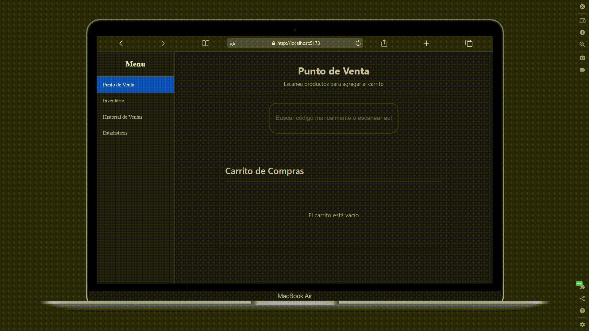
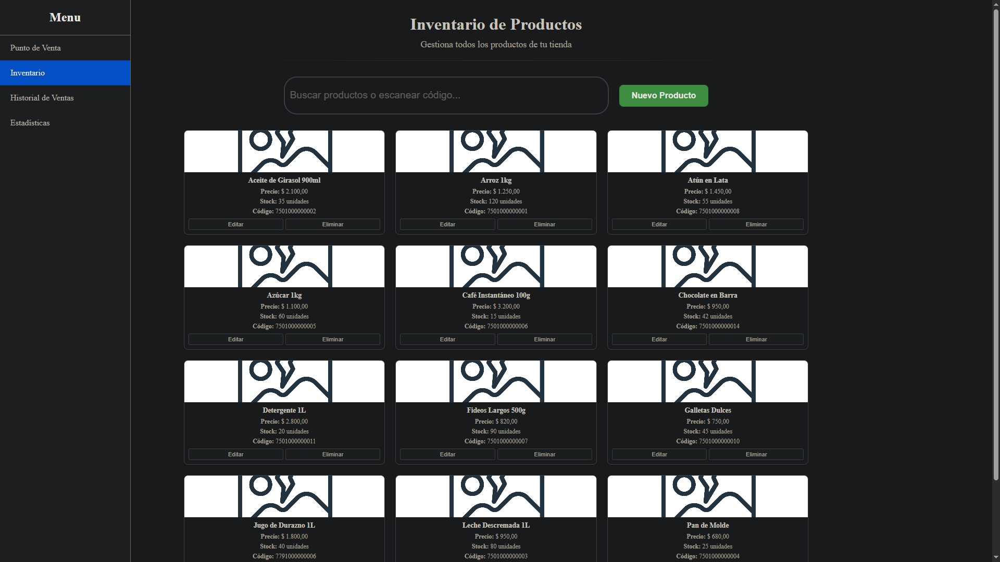
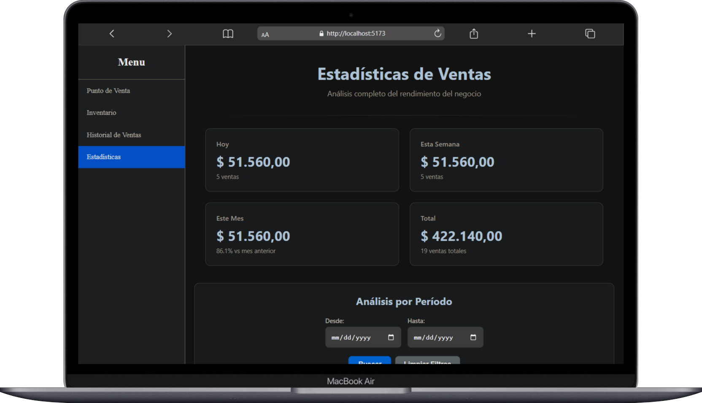
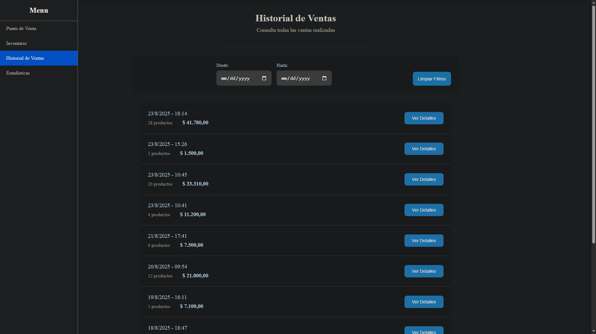
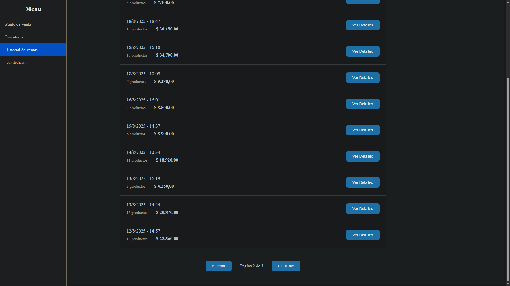

# 🛒 Sistema POS - Punto de Venta Web

> **Sistema completo de punto de venta con escaneo de códigos de barras, gestión de inventario y estadísticas en tiempo real**


*Demostración en vivo: escaneando códigos de barras y agregando productos al carrito automáticamente*

## ✨ Características Principales

🛍️ **Sistema de Ventas** - Carrito interactivo con validación de stock  
📦 **Gestión de Inventario** - CRUD completo de productos  
📊 **Estadísticas Avanzadas** - Dashboard con métricas y reportes  
📱 **Escaneo de Códigos** - Compatible con lectores físicos y app móvil  
🔍 **Búsqueda Inteligente** - Por nombre, código o escaneo automático  
📈 **Historial Completo** - Registro detallado de todas las ventas  

---

## 🚀 Instalación Rápida

```bash
# 1️⃣ Clonar repositorio
git clone https://github.com/GinoRobla/proyectos-personales.git
cd "proyectos-personales/Sistema ventas"

# 2️⃣ Instalar dependencias
cd backend && npm install
cd ../frontend && npm install

# 3️⃣ Configurar backend
cd ../backend && cp .env.example .env

# 4️⃣ Iniciar backend (Terminal 1)
node index.js

# 5️⃣ Poblar con datos de ejemplo (Terminal 2)
node db/seedCompleto.js

# 6️⃣ Iniciar frontend (Terminal 3)
cd ../frontend && npm run dev
```

**🎉 ¡Listo! Abre http://localhost:5173**

---

## 📱 Escaneo de Códigos de Barras

### Opción 1: Lector Físico
Conecta cualquier lector USB/Bluetooth y funciona automáticamente.

### Opción 2: App Móvil (Barcode to PC Server)

1. **📲 Instalar en el celular:**
   - Descargar "Barcode to PC Server" desde Play Store/App Store

2. **💻 Instalar en la PC:**
   - Descargar desde [barcodetopc.com](https://barcodetopc.com)

3. **📶 Configuración:**
   - Conectar ambos dispositivos a la **misma red WiFi**
   - Iniciar la app en el celular
   - Abrir el programa en la PC
   - ¡Ya puedes escanear desde el móvil!

### 🎯 Funcionamiento Automático
- Escanea cualquier código → se busca automáticamente el producto
- No necesitas hacer clic en campos de búsqueda
- El producto se agrega al carrito instantáneamente

---

## 🖥️ Interfaz y Navegación

### 🏠 **Ventas**

*Demostración del carrito de compras interactivo en funcionamiento*
- Búsqueda y selección de productos
- Carrito de compras interactivo
- Finalización de ventas con impresión

### 📦 **Inventario**  

- Agregar, editar y eliminar productos
- Control de stock automático
- Imágenes de productos

### 📊 **Estadísticas**

- Ganancias de hoy/semana/mes
- Top productos más vendidos
- Análisis por rangos de fecha
- Productos con poco stock

### 📋 **Historial**


- Registro completo de ventas
- Filtrado por fechas
- Detalles de cada venta
- Paginación inteligente

---

## ⚙️ Arquitectura y Tecnologías

### 🎯 **Stack Principal**

#### **Frontend - React + Vite**
- **React 19**: Framework para UI con hooks personalizados (`useApi`, `useCart`, `useScanner`)
- **Vite**: Bundler rápido con hot reload para desarrollo ágil
- **CSS3 Puro**: Estilos optimizados sin dependencias externas

#### **Backend - Node.js + Express**
- **Express 5**: API REST con arquitectura modular (Controllers/Services/Models)
- **Sequelize ORM**: Abstracción de base de datos con soporte dual SQLite/PostgreSQL

#### **Base de Datos - Estrategia Dual**
- **SQLite**: Para desarrollo local, sin instalaciones externas
- **PostgreSQL**: Preparado para producción, escalabilidad empresarial

### 🖥️ **Diseñado para PC/Notebook**

#### **Optimización Desktop**
- **Pantallas grandes**: Layout optimizado para resoluciones 1580px+ 
- **Responsive notebook**: Adaptación específica para pantallas <1675px (3→2 columnas en inventario)
- **No mobile**: Interfaz pensada para uso profesional en escritorio
- **Teclado físico**: Integración perfecta con lectores de códigos USB/Bluetooth

### ⚡ **Experiencia Sin Fricción**

#### **Auto-enfoque Inteligente**
- **Inputs activos**: Los campos de búsqueda se enfocan automáticamente
- **Escaneo directo**: Los códigos se capturan sin hacer clic en campos
- **Limpieza automática**: Cada escaneo borra el contenido anterior
- **Mínimo mouse**: El usuario puede operar casi completamente con el lector

#### **Flujo Optimizado**
```
🔍 Escanear código → 🎯 Producto encontrado → ➕ Al carrito → 🔍 Listo para siguiente
```

### 🔧 **Optimizaciones de Rendimiento**

#### **Paginación Server-Side**
- **Historial**: Solo 10 ventas por página para carga rápida
- **Sin lag**: Navegación fluida entre páginas
- **Memoria eficiente**: No carga miles de registros innecesarios

#### **Búsqueda Instantánea**
- **Tiempo real**: Resultados mientras escribes
- **Índices optimizados**: Búsqueda por nombre y código de barras
- **Validación automática**: Stock verificado antes de agregar al carrito

#### **Gestión de Stock Automática**
- **Transacciones atómicas**: Venta + reducción de stock en una operación
- **Validaciones**: Previene sobreventa automáticamente
- **Actualización instantánea**: Los cambios se reflejan inmediatamente  

---

## 📚 Documentación Adicional

- 📖 **[Documentación de API](./DOCUMENTACION_API.md)** - Endpoints completos
- 🔧 **Configuración avanzada** - Variables de entorno
- 🧪 **Datos de prueba** - Scripts de seeders incluidos

---

## 🎯 Estado del Proyecto

✅ **Funcional al 100%** - Listo para uso en entornos reales  
✅ **Base de datos local** - Sin dependencias externas  
✅ **Responsive design** - Optimizado para escritorio  
✅ **Escaneo automático** - Integración perfecta con códigos de barras  

---

## 📞 Soporte

¿Problemas con la instalación? ¿Dudas sobre el uso?

- 📧 Abrir un **Issue** en GitHub
- 💡 Consultar la **documentación de API**
- 🔍 Revisar los **archivos de ejemplo**

---

**Desarrollado con ❤️ para facilitar la gestión de ventas e inventario**

*Sistema POS Web v1.0 - Listo para producción* ✨