# Sistema de Gestión de Barbería

Sistema completo de gestión y reservas online para barberías, desarrollado con **React** (frontend) y **Node.js/Express** (backend). Incluye gestión de turnos, barberos, servicios, estadísticas en tiempo real y notificaciones automáticas por WhatsApp.

---

## Tabla de Contenidos

- [Características Principales](#características-principales)
- [Tecnologías Utilizadas](#tecnologías-utilizadas)
- [Arquitectura del Sistema](#arquitectura-del-sistema)
- [Roles y Funcionalidades](#roles-y-funcionalidades)
  - [Cliente](#rol-cliente)
  - [Barbero](#rol-barbero)
  - [Administrador](#rol-administrador)
- [Instalación y Configuración](#instalación-y-configuración)
- [Variables de Entorno](#variables-de-entorno)
- [Estructura del Proyecto](#estructura-del-proyecto)
- [API Endpoints](#api-endpoints)
- [Capturas de Pantalla](#capturas-de-pantalla)
- [Características Técnicas Destacadas](#características-técnicas-destacadas)

---

## Características Principales

- **Sistema de Reservas Inteligente**: Reserva de turnos en 4 pasos con validación de disponibilidad en tiempo real
- **Gestión Multi-Rol**: 3 roles con permisos diferenciados (Cliente, Barbero, Administrador)
- **Notificaciones WhatsApp**: Recordatorios automáticos 30 minutos antes del turno vía Twilio
- **Estadísticas Completas**: Dashboard con métricas, gráficos y reportes detallados
- **Asignación Automática**: Distribución equitativa de turnos entre barberos disponibles
- **Tareas Programadas**: Cron jobs para recordatorios, completado automático de turnos y reportes diarios
- **Diseño Responsive**: Interfaz adaptable a cualquier dispositivo (mobile-first)
- **Seguridad Robusta**: Autenticación JWT, encriptación bcrypt, validación de roles

---

## Tecnologías Utilizadas

### Backend
| Tecnología | Versión | Descripción |
|-----------|---------|-------------|
| **Node.js** | v18+ | Runtime JavaScript |
| **Express.js** | ^4.18.2 | Framework web minimalista |
| **MongoDB** | Última | Base de datos NoSQL |
| **Mongoose** | ^8.0.3 | ODM para MongoDB |
| **JWT** | ^9.0.2 | Autenticación basada en tokens |
| **bcrypt** | ^6.0.0 | Encriptación de contraseñas |
| **Twilio** | ^5.10.2 | Integración con WhatsApp |
| **node-cron** | ^3.0.3 | Programación de tareas automáticas |
| **dotenv** | ^16.3.1 | Gestión de variables de entorno |
| **CORS** | ^2.8.5 | Control de acceso entre orígenes |

### Frontend
| Tecnología | Versión | Descripción |
|-----------|---------|-------------|
| **React** | ^18.2.0 | Biblioteca UI |
| **React Router DOM** | ^6.20.0 | Enrutamiento SPA |
| **Axios** | ^1.6.2 | Cliente HTTP |
| **Vite** | ^5.0.8 | Build tool y dev server |
| **CSS Vanilla** | - | Estilos personalizados |

---

## Arquitectura del Sistema

### Modelos de Datos

#### Usuario (Base para autenticación)
```javascript
{
  nombre: String,
  apellido: String,
  email: String (único),
  password: String (encriptado con bcrypt),
  telefono: String (validado - formato argentino),
  rol: 'cliente' | 'barbero' | 'admin',
  foto: String,
  activo: Boolean,
  ultimoLogin: Date,
  barberoAsociado: ObjectId (ref: Barbero)
}
```

#### Barbero
```javascript
{
  usuario: ObjectId (ref: Usuario),
  nombre: String,
  apellido: String,
  email: String (único),
  telefono: String,
  foto: String,
  activo: Boolean,
  objetivoMensual: Number
}
```

#### Cliente
```javascript
{
  usuario: ObjectId (ref: Usuario),
  nombre: String,
  apellido: String,
  email: String (único),
  telefono: String,
  telefonoVerificado: Boolean,
  activo: Boolean
}
```

#### Servicio
```javascript
{
  nombre: String (único),
  descripcion: String,
  precioBase: Number,
  duracion: Number (minutos: 15-240),
  activo: Boolean
}
```

#### Turno (Reserva)
```javascript
{
  cliente: ObjectId (ref: Cliente),
  barbero: ObjectId (ref: Barbero),
  servicio: ObjectId (ref: Servicio),
  fecha: Date,
  hora: String (HH:mm),
  estado: 'reservado' | 'completado' | 'cancelado',
  precio: Number,
  recordatorioEnviado: Boolean
}
```

### Relaciones
- **Usuario → Barbero/Cliente**: 1:1 (opcional)
- **Turno → Cliente**: N:1
- **Turno → Barbero**: N:1
- **Turno → Servicio**: N:1

---

## Roles y Funcionalidades

### Rol: Cliente

**Acceso**: `/cliente`

#### Funcionalidades

##### Dashboard
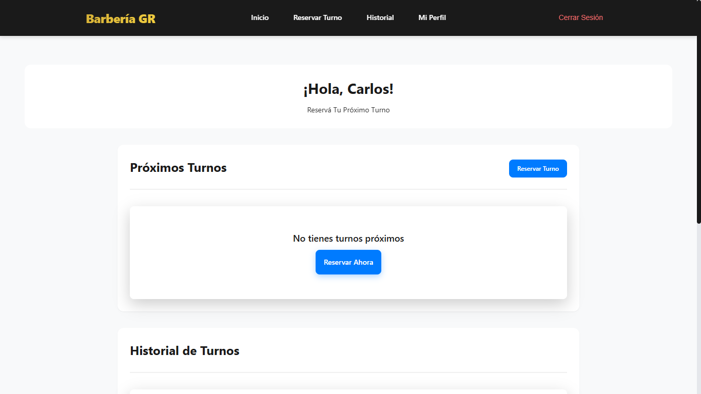
- Vista rápida de próximos turnos
- Estado de reservas actuales
- Acceso rápido a funciones principales

##### Reservar Turno (4 Pasos)
- **Paso 1**: Selección de servicio
  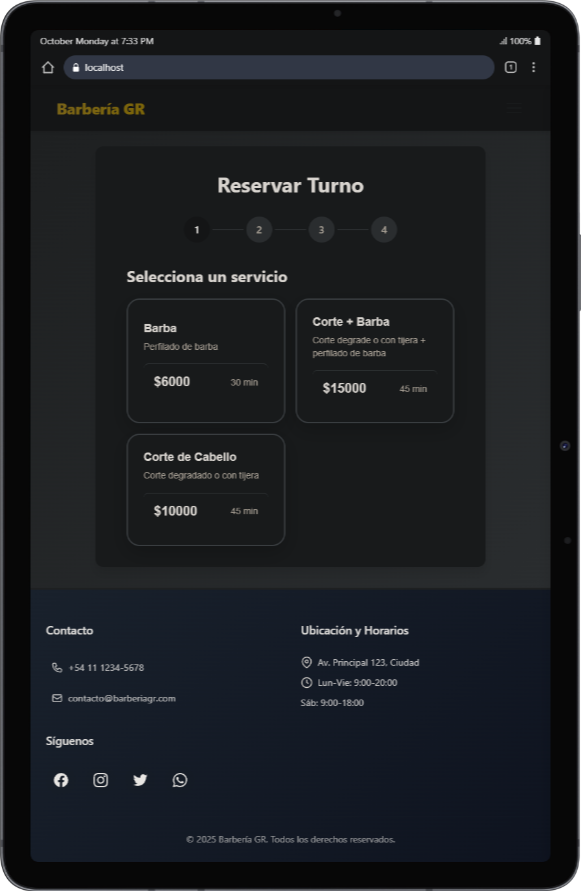

- **Paso 2**: Elección de barbero (opcional)
  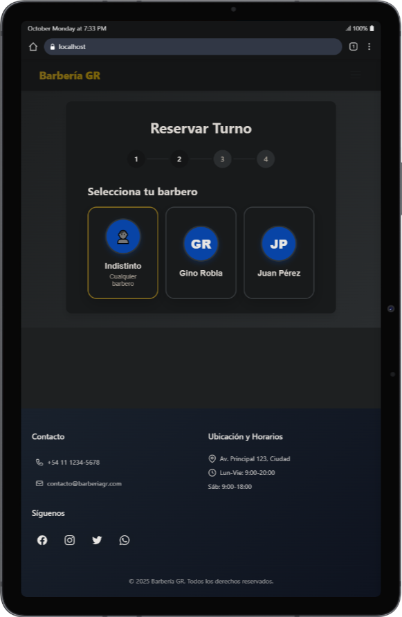

- **Paso 3**: Selección de fecha y horario disponible
  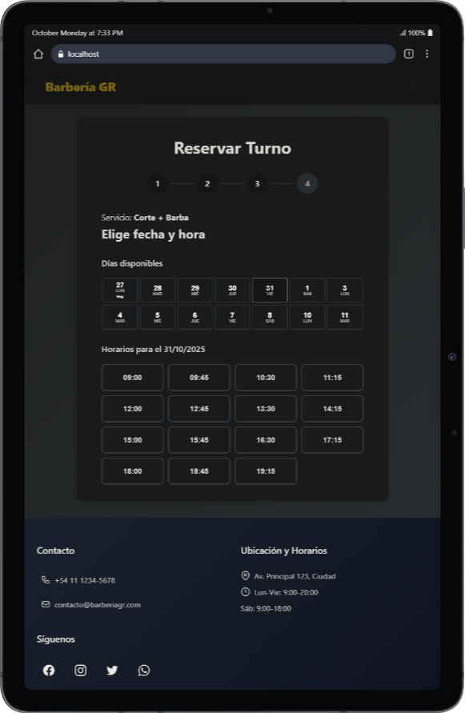

- **Paso 4**: Confirmación de datos y reserva
  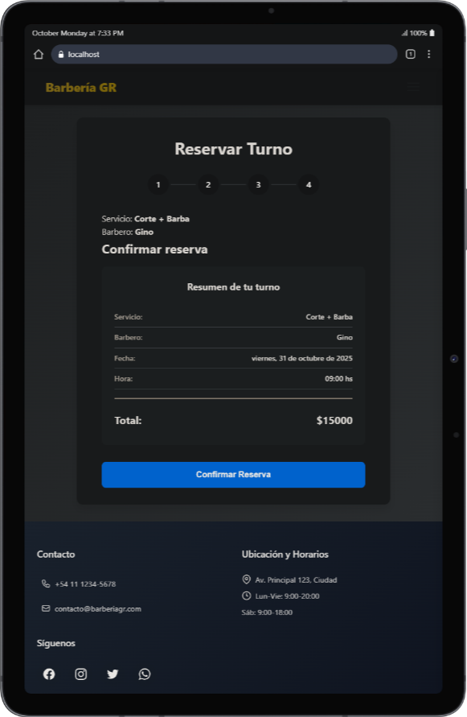

##### Mis Turnos
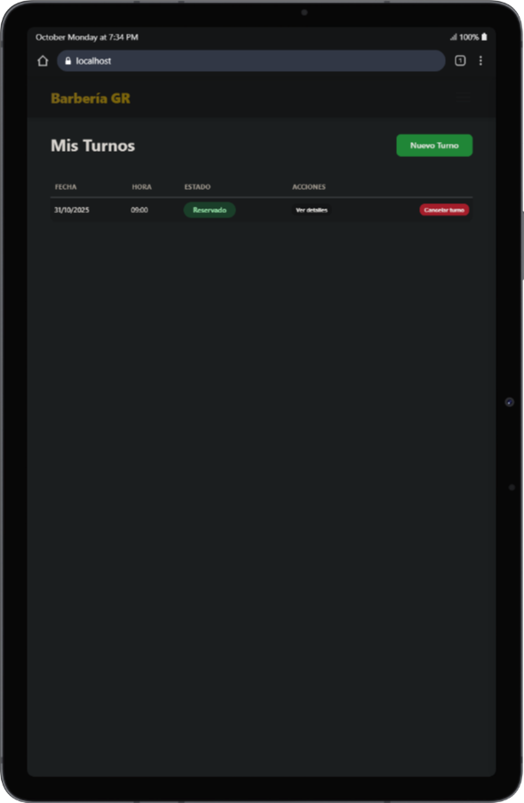
- Listado completo de reservas
- Filtros por estado (reservado, completado, cancelado)
- Opción de cancelar turnos
- Paginación de resultados

##### Mi Perfil
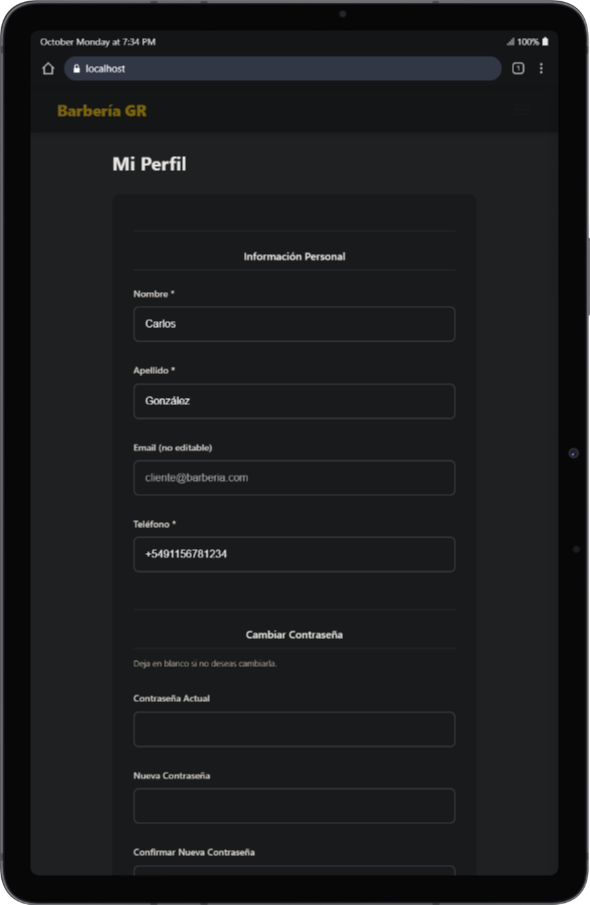
- Editar datos personales
- Actualizar teléfono y email
- Cambiar contraseña
- Subir foto de perfil

##### Otras Capturas
- [Registro](screenshots/cliente/register.png)
- [Inicio de Sesión](screenshots/cliente/inicio-sesion.png)
- [Menú Hamburguesa](screenshots/cliente/menu-hamb.png)
- [Inicio con Turno Reservado](screenshots/cliente/inicio-con-turno-reservado.png)

---

### Rol: Barbero

**Acceso**: `/barbero`

#### Funcionalidades

##### Dashboard
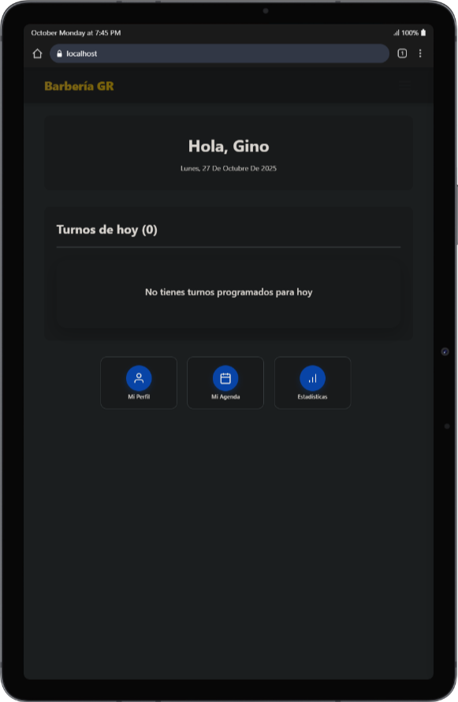
- Resumen de turnos del día
- Estadísticas rápidas
- Próximas citas programadas

##### Mi Agenda
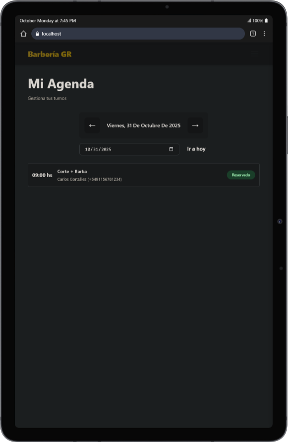
- Calendario completo de turnos asignados
- Detalles de cada cita (cliente, servicio, hora)
- Marcar turnos como completados
- Vista por fecha

##### Estadísticas Personales
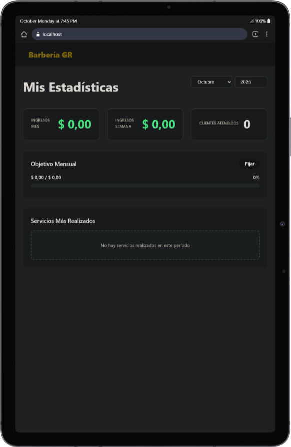
- Ingresos mensuales y semanales
- Turnos completados
- Progreso hacia objetivo mensual
- Servicios más realizados
- Gráficos de rendimiento

##### Mi Perfil
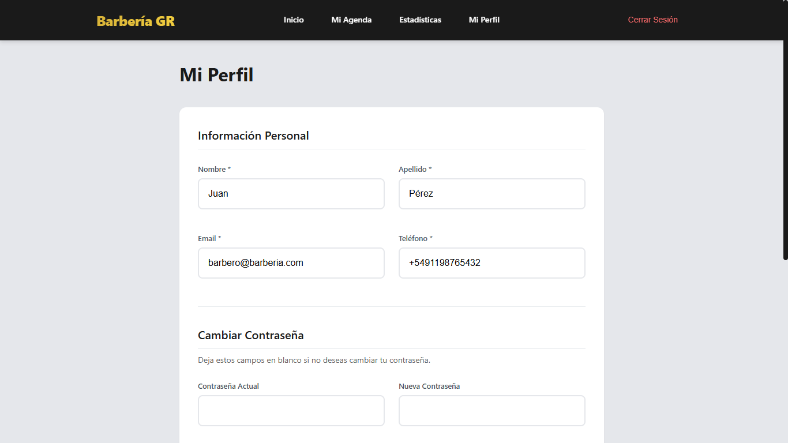
- Editar información personal
- Actualizar disponibilidad
- Cambiar contraseña
- Gestionar foto de perfil

---

### Rol: Administrador

**Acceso**: `/admin`

#### Funcionalidades

##### Dashboard Principal
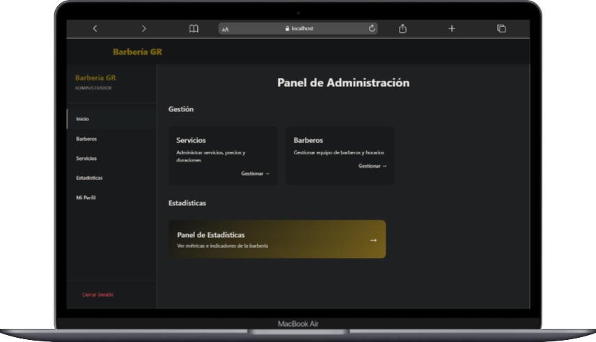
- Indicadores clave de rendimiento (KPIs):
  - Ingresos totales del mes
  - Turnos completados y cancelados
  - Clientes atendidos
  - Barbero más solicitado
  - Servicio más popular
- Comparativa mes vs mes anterior
- Gráficos de tendencias

##### Gestión de Barberos
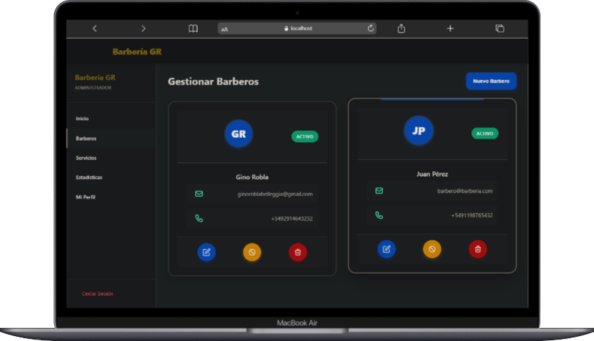
- Crear, editar y eliminar barberos
- Asignar objetivos mensuales
- Activar/desactivar barberos
- Ver estadísticas individuales
- Gestionar credenciales de acceso

##### Gestión de Servicios
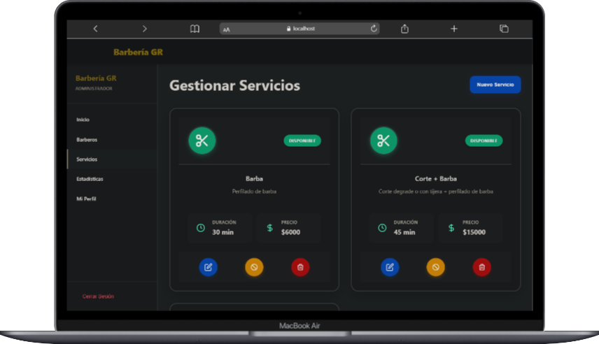
- CRUD completo de servicios
- Configurar precio y duración
- Activar/desactivar servicios
- Historial de modificaciones

##### Estadísticas Avanzadas
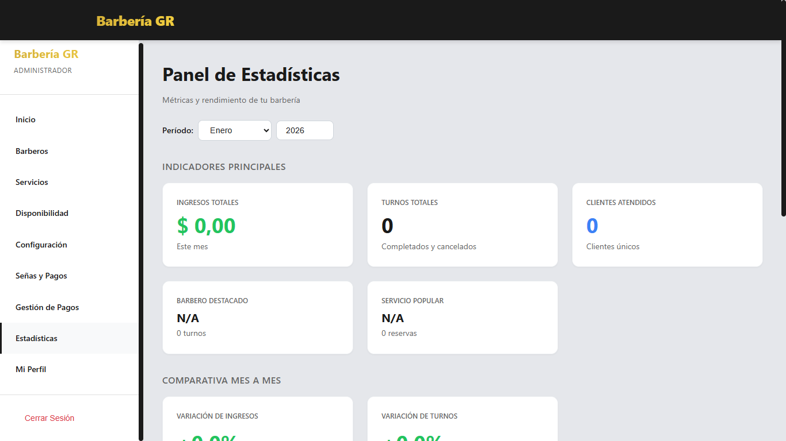
- Reportes detallados por período
- Ranking de barberos
- Top 3 clientes más frecuentes
- Análisis por día de semana
- Servicios más solicitados
- Métricas de ocupación
- Comparativas y tendencias

##### Mi Perfil
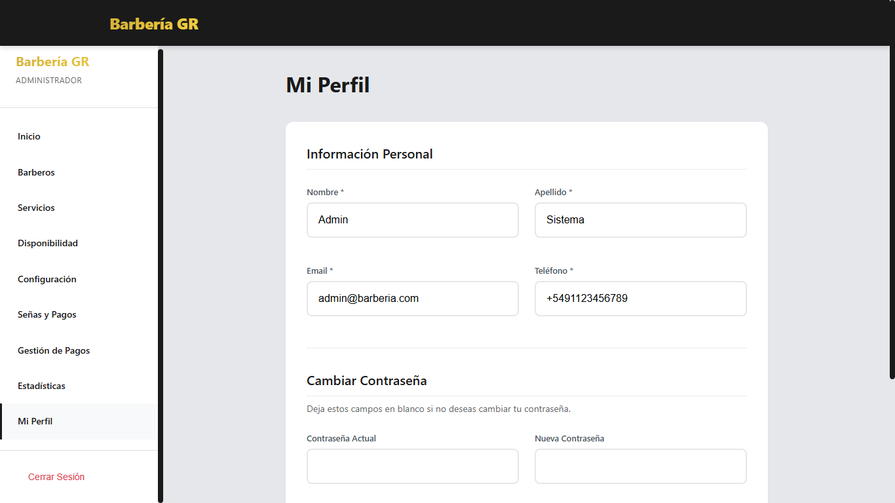
- Gestión de cuenta de administrador
- Cambiar contraseña
- Actualizar datos de contacto

---

## Instalación y Configuración

### Prerequisitos

- **Node.js** v18 o superior
- **MongoDB** (local o remoto)
- **Cuenta Twilio** (para WhatsApp, opcional)

### 1. Clonar el Repositorio

```bash
git clone https://github.com/GinoRobla/proyectos-personales.git
cd Gestion\ barberia
```

### 2. Configurar Backend

```bash
cd backend
npm install
```

Crear archivo `.env` en la carpeta `backend`:

```env
# Servidor
PORT=3000

# Base de datos
MONGODB_URI=mongodb://localhost:27017/barberia

# Negocio
BUSINESS_NAME=Barbería GR

# Frontend
FRONTEND_URL=http://localhost:5173

# Twilio (WhatsApp) - Opcional
TWILIO_ACCOUNT_SID=tu-sid
TWILIO_AUTH_TOKEN=tu-token
TWILIO_WHATSAPP_FROM=whatsapp:+1234567890

# JWT
JWT_SECRET=tu-clave-secreta-muy-segura
JWT_EXPIRATION=7d

# Recordatorios
ANTICIPACION_RECORDATORIO_MINUTOS=30
```

### 3. Configurar Frontend

```bash
cd ../frontend
npm install
```

Crear archivo `.env` en la carpeta `frontend`:

```env
VITE_API_URL=http://localhost:3000
```

### 4. Inicializar Base de Datos

```bash
cd ../backend
npm run seed
```

Este comando crea usuarios por defecto:
- **Admin**: admin@barberia.com / admin123
- **Barbero**: barbero@barberia.com / barbero123
- **Cliente**: cliente@barberia.com / cliente123

### 5. Ejecutar el Proyecto

**Backend** (en una terminal):
```bash
cd backend
npm run dev
```

**Frontend** (en otra terminal):
```bash
cd frontend
npm run dev
```

Acceder a:
- **Frontend**: http://localhost:5173
- **Backend**: http://localhost:3000
- **Health Check**: http://localhost:3000/api/health

---

## Variables de Entorno

### Backend (.env)

| Variable | Descripción | Ejemplo |
|---------|-------------|---------|
| `PORT` | Puerto del servidor | `3000` |
| `MONGODB_URI` | URI de conexión a MongoDB | `mongodb://localhost:27017/barberia` |
| `BUSINESS_NAME` | Nombre del negocio | `Barbería GR` |
| `FRONTEND_URL` | URL del frontend | `http://localhost:5173` |
| `TWILIO_ACCOUNT_SID` | SID de cuenta Twilio | `AC...` |
| `TWILIO_AUTH_TOKEN` | Token de autenticación Twilio | `...` |
| `TWILIO_WHATSAPP_FROM` | Número WhatsApp Twilio | `whatsapp:+14155238886` |
| `JWT_SECRET` | Clave secreta para JWT | `mi-clave-super-secreta-2024` |
| `JWT_EXPIRATION` | Tiempo de expiración del token | `7d` |
| `ANTICIPACION_RECORDATORIO_MINUTOS` | Minutos antes del turno para recordatorio | `30` |

### Frontend (.env)

| Variable | Descripción | Ejemplo |
|---------|-------------|---------|
| `VITE_API_URL` | URL del backend | `http://localhost:3000` |

---

## Estructura del Proyecto

```
Gestion barberia/
├── backend/
│   ├── config/
│   │   └── conexion.js                 # Configuración MongoDB
│   ├── controllers/
│   │   ├── authController.js           # Lógica autenticación
│   │   ├── barberoController.js        # Lógica barberos
│   │   ├── servicioController.js       # Lógica servicios
│   │   ├── turnoController.js          # Lógica turnos
│   │   └── estadisticasController.js   # Lógica estadísticas
│   ├── middlewares/
│   │   ├── authMiddleware.js           # Verificación JWT y roles
│   │   └── paginacionMiddleware.js     # Paginación de resultados
│   ├── models/
│   │   ├── Usuario.js                  # Modelo Usuario
│   │   ├── Barbero.js                  # Modelo Barbero
│   │   ├── Cliente.js                  # Modelo Cliente
│   │   ├── Turno.js                    # Modelo Turno
│   │   ├── Servicio.js                 # Modelo Servicio
│   │   └── index.js                    # Export de modelos
│   ├── routes/
│   │   ├── authRoutes.js               # Endpoints autenticación
│   │   ├── barberoRoutes.js            # Endpoints barberos
│   │   ├── servicioRoutes.js           # Endpoints servicios
│   │   ├── turnoRoutes.js              # Endpoints turnos
│   │   └── estadisticasRoutes.js       # Endpoints estadísticas
│   ├── services/
│   │   ├── authService.js              # Lógica autenticación
│   │   ├── barberoService.js           # Lógica barberos
│   │   ├── turnoService.js             # Lógica turnos
│   │   ├── servicioService.js          # Lógica servicios
│   │   ├── estadisticasService.js      # Lógica estadísticas
│   │   ├── cronService.js              # Tareas programadas
│   │   ├── whatsappService.js          # Integración Twilio
│   │   └── perfilService.js            # Gestión perfiles
│   ├── utils/
│   │   └── phoneValidator.js           # Validación teléfonos
│   ├── scripts/
│   │   ├── crearUsuariosIniciales.js   # Script usuarios default
│   │   └── limpiarBaseDeDatos.js       # Script limpieza DB
│   ├── index.js                        # Entrada principal
│   ├── package.json                    # Dependencias backend
│   └── .env                            # Variables de entorno
│
├── frontend/
│   ├── src/
│   │   ├── components/
│   │   │   ├── AdminSidebar.jsx        # Menú lateral admin
│   │   │   ├── Navbar.jsx              # Barra navegación
│   │   │   ├── ProtectedRoute.jsx      # Rutas protegidas
│   │   │   ├── Layout.jsx              # Layout principal
│   │   │   ├── Toast.jsx               # Notificaciones
│   │   │   ├── LoadingSpinner.jsx      # Indicador carga
│   │   │   └── Footer.jsx              # Pie de página
│   │   ├── context/
│   │   │   ├── AuthContext.jsx         # Estado autenticación
│   │   │   └── ToastContext.jsx        # Estado notificaciones
│   │   ├── hooks/
│   │   │   ├── useApi.js               # Hook llamadas API
│   │   │   ├── useFormData.js          # Hook formularios
│   │   │   └── useModal.js             # Hook modales
│   │   ├── pages/
│   │   │   ├── HomePage.jsx            # Página inicio
│   │   │   ├── LoginPage.jsx           # Login
│   │   │   ├── RegisterPage.jsx        # Registro
│   │   │   ├── ReservarTurnoPage.jsx   # Reserva 4 pasos
│   │   │   ├── cliente/                # Páginas cliente
│   │   │   ├── barbero/                # Páginas barbero
│   │   │   └── admin/                  # Páginas admin
│   │   ├── services/
│   │   │   ├── api.js                  # Config axios
│   │   │   ├── authService.js          # Servicios auth
│   │   │   ├── barberoService.js       # Servicios barberos
│   │   │   ├── servicioService.js      # Servicios servicios
│   │   │   ├── turnoService.js         # Servicios turnos
│   │   │   └── estadisticasService.js  # Servicios estadísticas
│   │   ├── utils/
│   │   │   ├── constants.js            # Constantes
│   │   │   ├── dateUtils.js            # Utils fechas
│   │   │   └── formatters.js           # Formateadores
│   │   ├── App.jsx                     # Componente raíz
│   │   └── main.jsx                    # Punto entrada
│   ├── package.json                    # Dependencias frontend
│   ├── vite.config.js                  # Config Vite
│   └── .env                            # Variables entorno
│
└── screenshots/                        # Capturas de pantalla
    ├── admin/
    ├── barbero/
    └── cliente/
```

---

## API Endpoints

### Autenticación (`/api/auth`)

| Método | Endpoint | Descripción | Auth |
|--------|----------|-------------|------|
| POST | `/api/auth/registro` | Registrar nuevo usuario | No |
| POST | `/api/auth/login` | Iniciar sesión | No |
| GET | `/api/auth/verificar` | Verificar token JWT | Sí |
| GET | `/api/auth/perfil` | Obtener perfil del usuario | Sí |
| PUT | `/api/auth/perfil` | Actualizar perfil | Sí |
| PUT | `/api/auth/cambiar-password` | Cambiar contraseña | Sí |

### Barberos (`/api/barberos`)

| Método | Endpoint | Descripción | Auth | Rol |
|--------|----------|-------------|------|-----|
| GET | `/api/barberos` | Listar todos los barberos | No | - |
| GET | `/api/barberos/disponibles` | Barberos disponibles ahora | No | - |
| GET | `/api/barberos/:id` | Detalles de un barbero | No | - |
| GET | `/api/barberos/:id/horarios-disponibles` | Horarios libres del barbero | No | - |
| POST | `/api/barberos` | Crear nuevo barbero | Sí | admin |
| PUT | `/api/barberos/:id` | Actualizar barbero | Sí | admin |
| DELETE | `/api/barberos/:id` | Eliminar barbero | Sí | admin |

### Servicios (`/api/servicios`)

| Método | Endpoint | Descripción | Auth | Rol |
|--------|----------|-------------|------|-----|
| GET | `/api/servicios` | Listar todos los servicios | No | - |
| GET | `/api/servicios/:id` | Detalles del servicio | No | - |
| POST | `/api/servicios` | Crear nuevo servicio | Sí | admin |
| PUT | `/api/servicios/:id` | Actualizar servicio | Sí | admin |
| DELETE | `/api/servicios/:id` | Eliminar servicio | Sí | admin |

### Turnos (`/api/turnos`)

| Método | Endpoint | Descripción | Auth | Rol |
|--------|----------|-------------|------|-----|
| GET | `/api/turnos` | Listar todos los turnos (paginado) | Sí | admin |
| GET | `/api/turnos/mis-turnos` | Mis turnos (filtrado por rol) | Sí | cliente/barbero |
| GET | `/api/turnos/:id` | Detalles del turno | Sí | - |
| GET | `/api/turnos/horarios-disponibles` | Horarios libres para fecha/barbero | No | - |
| GET | `/api/turnos/dias-disponibles` | Próximos 14 días disponibles | No | - |
| POST | `/api/turnos` | Crear nuevo turno | Sí | - |
| PUT | `/api/turnos/:id` | Actualizar turno | Sí | admin |
| PATCH | `/api/turnos/:id/cancelar` | Cancelar turno | Sí | cliente/admin |

### Estadísticas (`/api/estadisticas`)

| Método | Endpoint | Descripción | Auth | Rol |
|--------|----------|-------------|------|-----|
| GET | `/api/estadisticas/admin` | Dashboard del administrador | Sí | admin |
| GET | `/api/estadisticas/generales` | Estadísticas generales | Sí | admin |
| GET | `/api/estadisticas/barbero/:id` | Estadísticas de un barbero | Sí | admin |
| GET | `/api/estadisticas/mis-estadisticas` | Mis estadísticas | Sí | barbero |

---

## Capturas de Pantalla

### Cliente
- [Inicio](screenshots/cliente/inicio.png)
- [Registro](screenshots/cliente/register.png)
- [Inicio de Sesión](screenshots/cliente/inicio-sesion.png)
- [Menú Hamburguesa](screenshots/cliente/menu-hamb.png)
- [Reservar Turno - Paso 1](screenshots/cliente/reservar-turno-1er-paso.png)
- [Reservar Turno - Paso 2](screenshots/cliente/reservar-turno-2do-paso.png)
- [Reservar Turno - Paso 3](screenshots/cliente/reservar-turno-3er-paso.png)
- [Reservar Turno - Paso 4](screenshots/cliente/reservar-turno-4to-paso.png)
- [Mis Turnos](screenshots/cliente/mis-turnos.png)
- [Mi Perfil](screenshots/cliente/mi-perfil.png)
- [Inicio con Turno Reservado](screenshots/cliente/inicio-con-turno-reservado.png)

### Barbero
- [Dashboard](screenshots/barbero/inicio.png)
- [Mi Agenda](screenshots/barbero/mi-agenda.png)
- [Estadísticas](screenshots/barbero/estadisticas.png)
- [Perfil](screenshots/barbero/perfil.png)

### Administrador
- [Dashboard](screenshots/admin/inicio.png)
- [Gestión de Barberos](screenshots/admin/gestion-barberos.png)
- [Gestión de Servicios](screenshots/admin/gesion-servicios.png)
- [Estadísticas](screenshots/admin/estadisticas.png)
- [Perfil](screenshots/admin/perfil.png)

---

## Características Técnicas Destacadas

### 1. Sistema de Reservas Inteligente

- **Asignación Automática de Barbero**: Si el cliente no elige barbero, el sistema distribuye equitativamente entre barberos disponibles
- **Validación de Disponibilidad en Tiempo Real**: Verifica horarios libres considerando duración del servicio
- **Horarios Dinámicos**:
  - Lunes a Viernes: 9:00 - 20:00
  - Sábado: 8:00 - 18:00
  - Domingos: Cerrado
- **Prevención de Conflictos**: Detecta solapamientos de turnos
- **Ventana de Reserva**: Próximos 14 días disponibles

### 2. Integración WhatsApp con Twilio

- **Recordatorios Automáticos**: 30 minutos antes del turno
- **Validación de Teléfonos Argentinos**: Soporta múltiples formatos
  - +549111234567
  - 549111234567
  - 91112345678
  - 01112345678
- **Notificaciones**:
  - Cliente: Recordatorio de turno próximo
  - Barbero: Notificación de cancelación
  - Admin: Reporte diario con estadísticas
- **Normalización Automática**: Convierte a formato +549XXXXXXXXX

### 3. Tareas Automáticas (Cron Jobs)

| Frecuencia | Tarea | Descripción |
|-----------|-------|-------------|
| Cada 5 min | Enviar recordatorios | Busca turnos próximos (30 min antes) |
| Cada 10 min | Completar turnos | Marca como completados turnos pasados |
| 20:30 (L-V) / 18:30 (S) | Reporte diario | Envía estadísticas del día al admin |

### 4. Autenticación y Seguridad

- **JWT (JSON Web Tokens)**: Tokens seguros con expiración configurable (7 días default)
- **Encriptación bcrypt**: Contraseñas hasheadas con salt automático
- **Middleware de Autorización**: Valida roles en cada endpoint protegido
- **CORS Configurado**: Solo orígenes autorizados
- **Validación de Entrada**: En backend y frontend

### 5. Estadísticas y Reportes

#### Dashboard Administrador
- Ingresos totales del mes
- Turnos completados/cancelados
- Clientes atendidos
- Barbero más solicitado
- Servicio más popular
- Comparativa mes vs mes anterior
- Ocupación por día de semana
- Top 3 clientes más frecuentes

#### Dashboard Barbero
- Ingresos mensuales y semanales
- Turnos completados
- Progreso hacia meta mensual
- Servicios más realizados
- Gráficos de tendencias

### 6. UX/UI Responsive

- **Mobile-First Design**: Adaptable a cualquier pantalla
- **Sistema de Notificaciones (Toast)**: Feedback visual de acciones
- **Loading Spinners**: Indicadores de carga
- **Paginación**: Resultados organizados
- **Filtros Avanzados**: Por estado, barbero, cliente, fecha
- **Navegación Intuitiva**: Menú hamburguesa en móvil, sidebar en desktop

### 7. Validaciones Robustas

- Teléfono argentino (formato específico)
- Email (formato válido)
- Campos requeridos (backend y frontend)
- Hora (formato HH:mm)
- Fechas (rango próximos 14 días)
- Duración de servicios (15-240 minutos)
- Precios (valores positivos)

---

## Scripts Disponibles

### Backend

```bash
npm start              # Iniciar servidor en producción
npm run dev            # Iniciar con nodemon (desarrollo)
npm run seed           # Crear usuarios iniciales
npm run limpiar        # Limpiar base de datos
npm run seed:test      # Generar datos de prueba
npm run screenshots    # Generar datos para screenshots
```

### Frontend

```bash
npm run dev            # Iniciar servidor de desarrollo (Vite)
npm run build          # Compilar para producción
npm run preview        # Previsualizar build de producción
```

---

## Flujos Principales

### Flujo de Registro y Login
1. Usuario completa formulario de registro
2. Backend valida datos y crea Usuario + Cliente/Barbero
3. Usuario inicia sesión con email/password
4. Backend valida credenciales y devuelve JWT
5. Frontend guarda token en localStorage
6. Redirige según rol a dashboard correspondiente

### Flujo de Reserva de Turno
1. Cliente selecciona servicio (Paso 1)
2. Elige barbero o deja que se asigne automáticamente (Paso 2)
3. Selecciona fecha y hora disponible (Paso 3)
   - Sistema consulta `/api/turnos/dias-disponibles`
   - Sistema consulta `/api/turnos/horarios-disponibles?fecha=...&barbero=...`
4. Confirma datos y reserva (Paso 4)
5. Backend crea turno y asigna barbero si es necesario
6. Cron job programa recordatorio WhatsApp 30 min antes

### Flujo de Cancelación
1. Cliente/Admin visualiza turno
2. Hace clic en "Cancelar"
3. Backend actualiza estado a 'cancelado'
4. Twilio envía notificación al barbero asignado

### Flujo de Tareas Automáticas
1. **Cada 5 min**: Cron busca turnos próximos → Envía recordatorio WhatsApp
2. **Cada 10 min**: Cron busca turnos pasados → Marca como 'completado'
3. **20:30 (L-V) / 18:30 (S)**: Cron calcula stats del día → Envía reporte al admin

---

## Licencia

Este proyecto es de uso privado.

---

## Contacto

Para consultas o sugerencias sobre este proyecto, contacta al desarrollador.

---

**Desarrollado con React + Node.js + MongoDB**