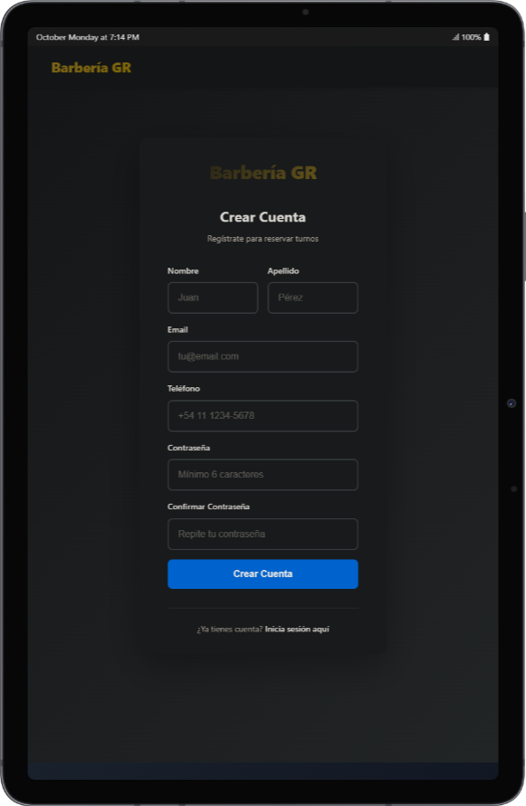
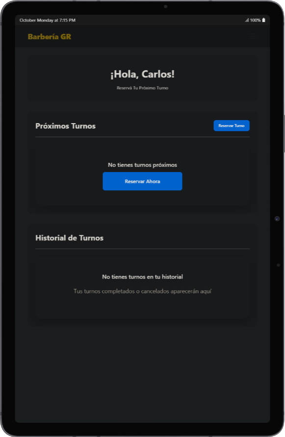
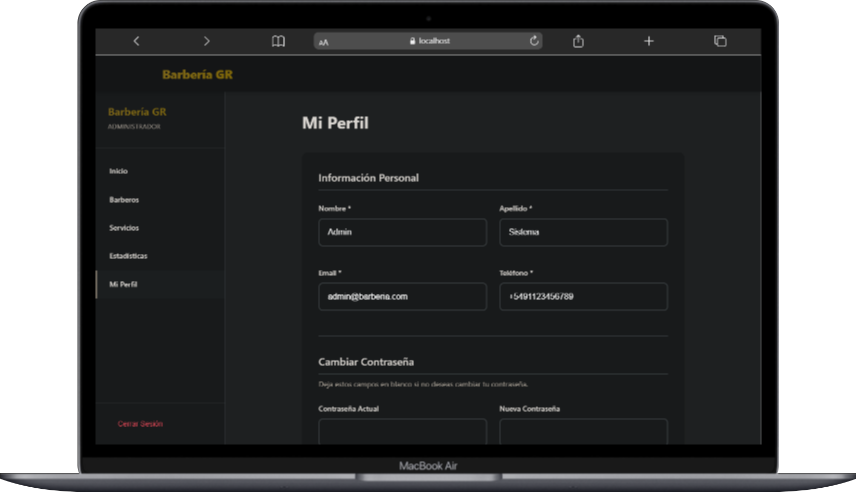

# 💈 Sistema de Gestión de Barbería

<div align="center">


Plataforma integral para gestión de barberías con reservas online, pagos digitales y notificaciones automáticas vía WhatsApp.

</div>

---

## 📋 Tabla de Contenidos

- [Sobre el Proyecto](#-sobre-el-proyecto)
- [Características](#-características)
- [Capturas de Pantalla](#-capturas-de-pantalla)
- [Stack Tecnológico](#️-stack-tecnológico)
- [Instalación](#-instalación)
- [Configuración](#️-configuración)
- [Uso](#-uso)
- [Estructura del Proyecto](#-estructura-del-proyecto)
- [Deployment](#-deployment)
- [Licencia](#-licencia)
- [Contacto](#-contacto)

---

## 🎯 Sobre el Proyecto

Sistema completo de gestión para barberías que digitaliza todo el proceso de negocio: desde la reserva de turnos hasta el pago de señas, pasando por recordatorios automáticos por WhatsApp y estadísticas en tiempo real.

### El Problema

Las barberías tradicionalmente manejan reservas por WhatsApp personal, anotaciones en papel o agendas físicas, lo que genera:

- 📱 **Pérdida de mensajes** y confusión de horarios entre clientes
- ⏰ **Olvidos constantes** de clientes que no asisten sin avisar
- 📊 **Cero visibilidad** de métricas para mejorar el negocio
- 💰 **Dificultad para gestionar señas** y pagos anticipados
- 👥 **Ineficiencia operativa** al no poder optimizar horarios

### La Solución

Plataforma web moderna que permite:

- ✅ Reservas online 24/7 sin intervención manual
- ✅ Pagos de señas con MercadoPago integrado
- ✅ Recordatorios automáticos por WhatsApp
- ✅ Dashboard con métricas y estadísticas en tiempo real
- ✅ Gestión completa de barberos, servicios y disponibilidad
- ✅ 3 roles diferenciados: Cliente, Barbero, Administrador

---

## ✨ Características

### 👤 Para Clientes

- **Reserva de turnos en 4 pasos**
  - Selección de servicio
  - Elección de barbero (o "cualquiera")
  - Calendario interactivo con horarios disponibles en tiempo real
  - Confirmación y pago de seña (si aplica)

- **Gestión de turnos**
  - Historial completo de turnos (pasados, próximos, cancelados)
  - Cancelación fácil con token único
  - Ver estado de pago y comprobantes

- **Notificaciones automáticas**
  - WhatsApp 30 minutos antes del turno
  - Recordatorio de pago pendiente
  - Confirmación al completar reserva

- **Verificación de teléfono**
  - Código de 6 dígitos por WhatsApp
  - Mayor seguridad y confiabilidad

- **Perfil personalizado**
  - Edición de datos personales
  - Cambio de contraseña
  - Foto de perfil

### 💼 Para Barberos

- **Agenda personalizada**
  - Vista diaria de turnos asignados
  - Información detallada de cada cliente
  - Marcar turnos como completados

- **Estadísticas de performance**
  - Turnos completados por periodo
  - Ingresos generados
  - Clientes atendidos
  - Progreso vs objetivo mensual
  - Gráficos de tendencias

- **Gestión de disponibilidad**
  - Configurar horarios de trabajo personalizados
  - Solicitar bloqueos (vacaciones, días libres)

- **Notificaciones**
  - WhatsApp al recibir nuevo turno
  - Alertas de cancelaciones

### 🔧 Para Administradores

- **Dashboard ejecutivo**
  - KPIs generales del negocio
  - Turnos del día/mes
  - Ingresos totales
  - Ocupación por barbero
  - Estadísticas de señas

- **Gestión de turnos**
  - CRUD completo
  - Filtros avanzados (estado, barbero, cliente, fecha)
  - Reasignar barberos
  - Marcar como completado/cancelado

- **Gestión de barberos**
  - Crear/editar/eliminar barberos
  - Establecer objetivos mensuales
  - Ver estadísticas individuales
  - Configurar horarios personalizados

- **Gestión de servicios**
  - CRUD de servicios ofrecidos
  - Definir precios
  - Activar/desactivar servicios
  - Marcar servicios premium (requieren seña obligatoria)

- **Sistema de señas configurable**
  - Activar/desactivar globalmente
  - Definir porcentaje de seña (10-100%)
  - Políticas: ninguno, todos, solo nuevos clientes, solo servicios premium
  - Aplicar/retener/devolver señas
  - Historial de pagos

- **Disponibilidad y horarios**
  - Horarios generales por día de semana
  - Horarios específicos por barbero
  - Bloqueos de fechas (feriados, eventos)
  - Bloqueos de rangos horarios

- **Configuración del negocio**
  - Nombre, dirección, teléfono, email
  - Logo y redes sociales
  - Duración de turnos (30/45/60 min)
  - Días permanentemente bloqueados
  - Políticas de cancelación

- **Reportes automáticos**
  - WhatsApp diario con resumen del día
  - Exportación de datos

---

## 📸 Capturas de Pantalla

### 🔐 Autenticación

<div align="center">

| Login | Registro |
|-------|----------|
|  |  |

</div>

### 👤 Panel de Cliente

<div align="center">

**Inicio**




**Proceso de Reserva de Turnos (4 Pasos)**

| Paso 1: Selección de Servicio | Paso 2: Elección de Barbero |
|-------------------------------|------------------------------|
|  |  |

| Paso 3: Selección de Fecha y Hora | Paso 4: Confirmación y Pago |
|-----------------------------------|----------------------------|
|  |  |

**Gestión de Perfil e Historial**

| Perfil | Historial de Turnos |
|--------|---------------------|
|  |  |

**Integración con MercadoPago**


</div>

### 💼 Panel de Barbero

<div align="center">

**Dashboard Principal**


**Gestión de Agenda y Estadísticas**

| Agenda del Día | Estadísticas de Performance |
|----------------|----------------------------|
|  |  |

**Perfil**


</div>

### 🔧 Panel de Administrador

<div align="center">

**Dashboard Ejecutivo**


**Gestión de Barberos y Servicios**

| Barberos | Servicios |
|----------|-----------|
|  |  |

**Disponibilidad y Horarios**

| Horarios Generales | Horarios por Barbero |
|-------------------|---------------------|
|  |  |

**Bloqueos y Excepciones**


**Configuración del Negocio**

| Información del Negocio | Redes y Duración de Turnos |
|------------------------|---------------------------|
|  |  |

**Días de Atención**


**Sistema de Señas y Pagos**

| Configuración de Señas | Credenciales MercadoPago |
|----------------------|-------------------------|
|  |  |

**Gestión de Pagos**


**Estadísticas Generales**


**Perfil de Administrador**



</div>

---

## 🛠️ Stack Tecnológico

### Backend

| Tecnología | Versión | Uso |
|-----------|---------|-----|
| Node.js | 18+ | Runtime de JavaScript |
| Express | 4.18 | Framework web (ES Modules) |
| MongoDB | 5+ | Base de datos NoSQL |
| Mongoose | 8.0 | ODM para MongoDB |
| JWT | - | Autenticación stateless |
| Bcrypt | - | Hashing de contraseñas |
| Passport.js | - | OAuth (Google) |
| Node-Cron | - | Tareas programadas |
| Express Validator | - | Validación de datos |

### Frontend

| Tecnología | Versión | Uso |
|-----------|---------|-----|
| React | 18.2 | Biblioteca UI |
| Vite | 5.0 | Build tool y dev server |
| React Router | 6 | Navegación SPA |
| Context API | - | State management |
| Axios | - | HTTP client |
| CSS Vanilla | - | Estilos |

### Servicios Externos

| Servicio | Uso |
|----------|-----|
| **Twilio** | Envío de WhatsApp (recordatorios, confirmaciones, reportes) |
| **MercadoPago** | Procesamiento de pagos de señas |
| **Gmail** | Envío de emails (confirmaciones, recuperación de contraseña) |
| **Google OAuth 2.0** | Login con cuenta Google |

### Seguridad

- **Helmet** - Headers de seguridad HTTP
- **Express-mongo-sanitize** - Protección contra NoSQL injection
- **Express-rate-limit** - Limitación de peticiones (anti brute-force)
- **CORS** - Control de orígenes cruzados
- **Custom CSRF** - Validación de header personalizado

---

## 📥 Instalación

### Requisitos Previos

- **Node.js** >= 18.0.0
- **MongoDB** >= 5.0 (o cuenta en MongoDB Atlas)
- **npm** o **yarn**
- Cuenta activa en **Twilio** (para WhatsApp)
- Cuenta de desarrollador en **MercadoPago**
- Cuenta de **Gmail** (para emails)

### 1. Clonar el Repositorio

```bash
git clone https://github.com/GinoRobla/proyectos-personales.git
cd "proyectos-personales/Web Barberias"
```

### 2. Instalar Dependencias

```bash
# Backend
cd backend
npm install

# Frontend
cd ../frontend
npm install
```

---

## ⚙️ Configuración

### Variables de Entorno

El proyecto requiere configurar variables de entorno en el backend y frontend.

Ver **[ENV_GUIDE.md](ENV_GUIDE.md)** para la guía completa de configuración de variables de entorno.

#### Backend (`backend/.env`)

Copiar `backend/.env.example` y configurar:

```env
# Servidor
PORT=3000
NODE_ENV=development

# Base de Datos
MONGODB_URI=mongodb://localhost:27017/barberia

# URLs
FRONTEND_URL=http://localhost:5173
BACKEND_URL=http://localhost:3000

# JWT
JWT_SECRET=tu-clave-super-secreta-cambiar-en-produccion
JWT_EXPIRATION=7d

# Twilio (WhatsApp)
TWILIO_ACCOUNT_SID=tu-twilio-account-sid
TWILIO_AUTH_TOKEN=tu-twilio-auth-token
TWILIO_WHATSAPP_FROM=whatsapp:+14155238886
ANTICIPACION_RECORDATORIO_MINUTOS=30

# MercadoPago
MERCADOPAGO_ACCESS_TOKEN=APP_USR-tu-access-token
MERCADOPAGO_PUBLIC_KEY=APP_USR-tu-public-key

# Email (Gmail)
EMAIL_USER=tucorreo@gmail.com
EMAIL_PASS=tu-app-password-de-gmail

# Negocio
NOMBRE_NEGOCIO=Barbería GR
BUSINESS_NAME=Barbería GR

# Google OAuth (opcional)
GOOGLE_CLIENT_ID=tu-google-client-id
GOOGLE_CLIENT_SECRET=tu-google-client-secret
GOOGLE_CALLBACK_URL=http://localhost:3000/api/auth/google/callback
```

#### Frontend (`frontend/.env`)

```env
VITE_API_URL=http://localhost:3000/api
```

### Poblar Base de Datos

Ejecutar el seed para crear datos de prueba:

```bash
cd backend
npm run seed
```

Esto crea:
- 1 Administrador
- 3 Barberos
- 15 Clientes de prueba
- 10 Servicios
- Configuración inicial del negocio

---

## 🚀 Uso

### Desarrollo Local

Abrir dos terminales:

**Terminal 1 - Backend:**
```bash
cd backend
npm run dev
```
Servidor en `http://localhost:3000`

**Terminal 2 - Frontend:**
```bash
cd frontend
npm run dev
```
Aplicación en `http://localhost:5173`

### Credenciales de Prueba

Después de ejecutar `npm run seed`:

**Administrador:**
- Email: `admin@barberia.com`
- Contraseña: `123456`

**Barberos:**
- `carlos@barberia.com` / `123456`
- `diego@barberia.com` / `123456`
- `mateo@barberia.com` / `123456`

**Clientes:**
- `juan1@mail.com` / `123456`
- `pedro2@mail.com` / `123456`
- (15 clientes disponibles: `usuario1-15@mail.com`)

### Scripts Disponibles

#### Backend

```bash
npm start          # Servidor en producción
npm run dev        # Servidor con auto-reload (nodemon)
npm run seed       # Poblar base de datos
```

#### Frontend

```bash
npm run dev        # Servidor de desarrollo
npm run build      # Build para producción
npm run preview    # Preview del build
```

---

## 📁 Estructura del Proyecto

```
Web Barberias/
├── backend/
│   ├── config/              # Configuraciones (Passport, rate limiter, validación env)
│   ├── controllers/         # Controladores de rutas
│   ├── middlewares/         # Middlewares (auth, validación, CSRF)
│   ├── models/              # Schemas de Mongoose
│   │   ├── Usuario.js
│   │   ├── Cliente.js
│   │   ├── Barbero.js
│   │   ├── Turno.js
│   │   ├── Servicio.js
│   │   ├── Pago.js
│   │   ├── DisponibilidadGeneral.js
│   │   ├── DisponibilidadBarbero.js
│   │   ├── Bloqueo.js
│   │   ├── CodigoVerificacion.js
│   │   ├── TokenRecuperacion.js
│   │   └── ConfiguracionNegocio.js
│   ├── routes/              # Rutas de la API
│   │   ├── authRoutes.js
│   │   ├── turnoRoutes.js
│   │   ├── pagoRoutes.js
│   │   ├── barberoRoutes.js
│   │   ├── servicioRoutes.js
│   │   ├── disponibilidadRoutes.js
│   │   ├── estadisticasRoutes.js
│   │   ├── configuracionRoutes.js
│   │   └── verificacionRoutes.js
│   ├── services/            # Lógica de negocio
│   │   ├── turnos/         # Servicios modulares de turnos
│   │   ├── estadisticas/   # Servicios de estadísticas
│   │   ├── authService.js
│   │   ├── whatsappService.js
│   │   ├── pagoService.js
│   │   ├── emailService.js
│   │   └── cronService.js
│   ├── scripts/             # Scripts de utilidad
│   │   ├── seed.js
│   │   └── backup-database.js
│   ├── validators/          # Validadores con express-validator
│   ├── utils/               # Utilidades y helpers
│   ├── index.js             # Entry point
│   ├── package.json
│   └── .env.example
│
├── frontend/
│   ├── src/
│   │   ├── components/      # Componentes reutilizables
│   │   ├── context/         # Context API (Auth, Toast)
│   │   ├── hooks/           # Custom hooks
│   │   ├── pages/           # Vistas por rol
│   │   │   ├── admin/       # Panel de administración
│   │   │   ├── barbero/     # Dashboard del barbero
│   │   │   ├── cliente/     # Área del cliente
│   │   │   └── reservarTurno/  # Flujo de reserva (4 pasos)
│   │   ├── services/        # API calls (Axios)
│   │   ├── utils/           # Helpers
│   │   ├── App.jsx          # Routing principal
│   │   └── main.jsx         # Entry point
│   ├── public/
│   ├── package.json
│   └── vite.config.js
│
├── API_DOC.md               # Documentación completa de la API
├── ENV_GUIDE.md             # Guía de configuración de variables
├── GUIA_DEPLOY_SIMPLE.md    # Guía de deployment
├── README.md                # Este archivo
└── .gitignore
```

---

## 🚢 Deployment

### Vercel + Railway (Recomendado)

La forma más fácil de deployar el proyecto es usando:
- **Vercel** para el frontend (React)
- **Railway** para el backend (Node.js + MongoDB)

Ver **[GUIA_DEPLOY_SIMPLE.md](GUIA_DEPLOY_SIMPLE.md)** para instrucciones detalladas paso a paso.

### Checklist Pre-Deployment

- [ ] Cambiar `JWT_SECRET` a valor aleatorio seguro
- [ ] Configurar `MONGODB_URI` de producción (MongoDB Atlas)
- [ ] Actualizar `FRONTEND_URL` y `BACKEND_URL` con dominios reales
- [ ] Configurar credenciales de **PRODUCCIÓN** en Twilio y MercadoPago
- [ ] Obtener Gmail App Password
- [ ] Ejecutar `npm audit` y resolver vulnerabilidades
- [ ] Configurar variables de entorno en plataforma de deploy
- [ ] Ejecutar seed en BD de producción
- [ ] Configurar dominio personalizado (opcional)
- [ ] Verificar que HTTPS esté activo

---

## 📚 Documentación Adicional

- **[API_DOC.md](API_DOC.md)** - Documentación completa de todos los endpoints de la API
- **[ENV_GUIDE.md](ENV_GUIDE.md)** - Guía detallada de configuración de variables de entorno
- **[GUIA_DEPLOY_SIMPLE.md](GUIA_DEPLOY_SIMPLE.md)** - Guía paso a paso de deployment
- **[CLAUDE.md](CLAUDE.md)** - Documentación técnica para desarrollo

---

## 🔒 Seguridad

El sistema implementa múltiples capas de seguridad:

- **Autenticación**: JWT con expiración configurable
- **Contraseñas**: Hasheadas con bcrypt (salt rounds: 10)
- **Rate Limiting**: Límites por IP en endpoints sensibles
- **CORS**: Configurado para dominios específicos
- **NoSQL Injection**: Sanitización de inputs con express-mongo-sanitize
- **Headers**: Helmet para headers de seguridad HTTP
- **CSRF**: Validación de header custom en endpoints críticos
- **Validación**: Express-validator en todos los inputs

---

## 🧪 Testing

_(En desarrollo)_

El proyecto está preparado para implementar tests unitarios y de integración:

```bash
# Backend (configurar Jest + Supertest)
cd backend
npm test

# Frontend (configurar Vitest + Testing Library)
cd frontend
npm test
```

---

## 🤝 Contribuir

Las contribuciones son bienvenidas. Para cambios importantes:

1. Fork del proyecto
2. Crear branch de feature: `git checkout -b feature/nueva-funcionalidad`
3. Commit de cambios: `git commit -m 'feat: agregar nueva funcionalidad'`
4. Push al branch: `git push origin feature/nueva-funcionalidad`
5. Abrir Pull Request

Ver [Conventional Commits](https://www.conventionalcommits.org/) para el formato de commits.

---

## 📄 Licencia

Este proyecto está bajo la Licencia MIT. Ver archivo [LICENSE](LICENSE) para más detalles.

---

## 👤 Contacto

**Gino Robla Belleggia**

- 💼 LinkedIn: [Gino Robla](https://www.linkedin.com/in/gino-robla-803a9337b/)
- 📧 Email: ginoroblabelleggia@gmail.com
- 🐙 GitHub: [@GinoRobla](https://github.com/GinoRobla)

---

## 🙏 Agradecimientos

- MercadoPago por la excelente documentación de su API
- Twilio por el sandbox de WhatsApp
- MongoDB y Mongoose por la documentación
- Comunidad de React y Node.js

---

<div align="center">

**⭐ Si este proyecto te resultó útil, dale una estrella en GitHub ⭐**

Desarrollado con ❤️ por [Gino Robla](https://github.com/GinoRobla)

</div>
